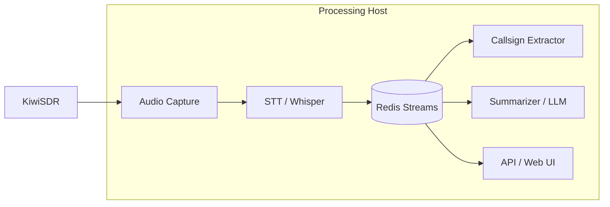

# ARIS 📻

> **Note:** This project is in early development and not yet functional. The KiwiSDR integration is not implemented - only mock audio works currently.

**Amateur Radio Intelligence System** - Real-time monitoring, transcription, and analysis of ham radio communications.

## Overview

ARIS is a local-first, GPU-accelerated system for continuous monitoring of amateur radio bands. It captures audio from KiwiSDR receivers, performs real-time speech-to-text transcription, extracts callsigns, and generates AI-powered summaries of QSOs and nets.

### Key Features

- **Real-time STT** using faster-whisper (GPU-accelerated)
- **Automatic callsign extraction** with phonetic alphabet support
- **AI-powered QSO summarization** using local LLMs
- **Multi-band monitoring** of HF/VHF/UHF frequencies
- **Local-only** - no cloud dependencies
- **Docker-based** microservices architecture
- **Web API and UI** for browsing and searching

## Architecture



## Services

1. **audio-capture** - Captures audio from KiwiSDR (or mock source)
2. **stt** - Speech-to-text using faster-whisper on GPU
3. **callsign-extractor** - Regex + phonetic callsign detection
4. **summarizer** - LLM-based QSO summarization
5. **api** - FastAPI web server with REST API and UI
6. **redis** - Message broker and data bus

## Quick Start

### Prerequisites

- Docker and Docker Compose
- NVIDIA GPU with CUDA support (for STT)
- nvidia-docker runtime configured
- Ollama running locally (for summarization)

### Installation

1. Clone the repository:
```bash
git clone git@github.com:alekm/ARIS.git
cd ARIS
```

2. Create environment file:
```bash
cp .env.example .env
# Edit .env with your settings
```

3. Start services in mock mode (no KiwiSDR required):
```bash
docker compose up -d
```

4. Access the web UI:
```bash
open http://localhost:8000
```

### With Real KiwiSDR

1. Update `.env`:
```bash
MODE=kiwi
KIWI_HOST=<your-kiwi-ip>
FREQUENCY_HZ=7200000  # Your target frequency
```

2. Update `services/audio-capture/config.yaml` with your settings

3. Restart services:
```bash
docker compose restart audio-capture
```

## Configuration

### Audio Capture (`services/audio-capture/config.yaml`)

```yaml
mode: kiwi  # or mock
kiwi_host: 192.168.1.100
frequency_hz: 7200000  # 40m band
mode: USB
sample_rate: 16000
```

### STT Settings (`.env`)

```bash
MODEL_SIZE=medium  # tiny, base, small, medium, large-v2, large-v3
DEVICE=cuda
VAD_THRESHOLD=0.5  # Voice activity detection sensitivity
```

### LLM Settings (`.env`)

```bash
# Option 1: Ollama
LLM_BACKEND=ollama
LLM_MODEL=llama3.2:latest
LLM_HOST=host.docker.internal:11434

# Option 2: OpenAI-compatible (text-generation-webui, vLLM, etc.)
LLM_BACKEND=openai
LLM_MODEL=your-model-name
LLM_HOST=host.docker.internal:5000  # text-generation-webui default port
LLM_API_KEY=not-needed
```

## API Endpoints

- `GET /` - Web UI
- `GET /docs` - Interactive API documentation
- `GET /api/stats` - System statistics
- `GET /api/transcripts?limit=50&frequency=7200000` - Recent transcripts
- `GET /api/callsigns?limit=50&callsign=W1AW` - Callsign detections
- `GET /api/qsos?limit=20` - QSO summaries
- `GET /api/search/callsign/{callsign}` - Search by callsign

## Development

### Project Structure

```
ARIS/
├── docker-compose.yml
├── .env.example
├── services/
│   ├── audio-capture/      # KiwiSDR audio ingestion
│   ├── stt/                # Speech-to-text
│   ├── callsign-extractor/ # Callsign NLP
│   ├── summarizer/         # LLM summaries
│   └── api/                # Web API/UI
├── shared/
│   └── models.py           # Common data structures
└── data/                   # Persistent data
    ├── audio/
    ├── transcripts/
    └── db/
```

### Viewing Logs

```bash
# All services
docker compose logs -f

# Specific service
docker compose logs -f stt
docker compose logs -f audio-capture
```

### Mock Mode Testing

The system includes a mock audio source for testing without KiwiSDR:

```bash
# Uses mock mode by default
docker compose up -d

# Mock generates test tones simulating voice frequencies
# View transcripts in real-time
docker compose logs -f stt
```

## Roadmap

### Phase 1: Basic Pipeline ✅
- [x] Docker architecture
- [x] Audio capture with mock source
- [x] STT pipeline
- [x] Callsign extraction
- [x] Basic API

### Phase 2: KiwiSDR Integration (In Progress)
- [ ] WebSocket client for KiwiSDR
- [ ] Multi-frequency monitoring
- [ ] Band-specific audio profiles

### Phase 3: Intelligence Features
- [ ] Alert system (callsign/keyword notifications)
- [ ] DX spot detection
- [ ] Net detection and tracking
- [ ] Historical trend analysis

### Phase 4: Production Hardening
- [ ] PostgreSQL for long-term storage
- [ ] Performance optimization
- [ ] Systemd service files
- [ ] Monitoring and health checks

## Hardware Requirements

### Minimum
- 8-core CPU
- 16GB RAM
- NVIDIA GPU with 4GB VRAM
- 100GB storage

### Recommended (Current)
- i9-10980XE (18 cores)
- 96GB RAM
- 2x NVIDIA A4000 (16GB each)
- 500GB NVMe SSD

## License

MIT License - See LICENSE file

## Contributing

Contributions welcome! Please open an issue or PR.

## Acknowledgments

- [KiwiSDR](http://kiwisdr.com/) - Remote SDR platform
- [faster-whisper](https://github.com/guillaumekln/faster-whisper) - Optimized Whisper
- [Ollama](https://ollama.ai/) - Local LLM runtime
