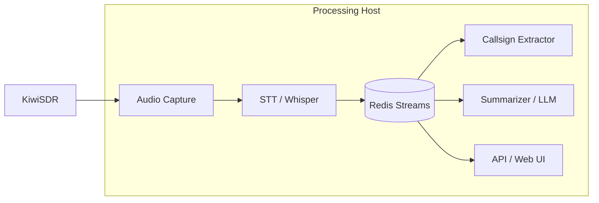

# ARIS 📻

> **Status:** KiwiSDR connectivity, real-time transcription, and QSO summarization are fully functional. **Note:** CW Decoder is currently under active development and is not yet functional.

**ARIS** (Amateur Radio Intelligence System) is a local-first, GPU-accelerated system for continuous monitoring of amateur radio bands. It captures audio from KiwiSDR receivers, performs real-time speech-to-text transcription, extracts callsigns, and generates AI-powered summaries of QSOs.

## Overview

ARIS is a local-first, GPU-accelerated system for continuous monitoring of amateur radio bands. It captures audio from KiwiSDR receivers, performs real-time speech-to-text transcription, extracts callsigns, and generates AI-powered summaries of QSOs and nets.

### Key Features

- **Real-time STT** using faster-whisper (GPU-accelerated) with hallucination filtering
- **Multi-language Translation** - Auto-detect source language and translate to English (configurable)
- **Automatic callsign extraction** with phonetic alphabet support
- **AI-powered QSO summarization** (local LLM) with automatic session gap detection and recursive summarization for long audio
- **Data Persistence** using SQLite for reliable storage of transcripts and history
- **KiwiSDR Integration** with robust passive-handshake connection
- **Web Dashboard** with real-time WebSocket updates for live monitoring
- **Multi-slot Management** - Configure and monitor up to 4 receiver slots via Web UI
- **Control** of Frequency and Mode (LSB/USB/AM/CW) directly from UI
- **Transcript Management** - View, search, and delete transcripts from the Web UI
- **Slot Persistence** - Slot configurations saved to database and automatically restored on restart
- **Local-only** - no cloud dependencies
- **Docker-based** microservices architecture

## Architecture



## Services

1. **audio-capture** - Captures audio from KiwiSDR (or mock source) with multi-slot support
2. **stt** - Speech-to-text using faster-whisper on GPU
3. **callsign-extractor** - Regex + phonetic callsign detection
4. **summarizer** - LLM-based QSO summarization
5. **api** - FastAPI web server with REST API and WebSocket support
6. **web** - React-based Web UI with real-time updates
7. **redis** - Message broker and data bus

## Quick Start

### Prerequisites

- Docker and Docker Compose
- NVIDIA GPU with CUDA support (for STT)
- nvidia-docker runtime configured
- Ollama running locally (for summarization)

### Installation

1. Clone the repository:
```bash
git clone git@github.com:alekm/ARIS.git
cd ARIS
```

2. Create environment file:
```bash
cp .env.example .env
# Edit .env with your settings
```

3. Start services in mock mode (no KiwiSDR required):
```bash
docker compose up -d
```

4. Access the web UI:
```bash
open http://localhost:3000
# API is available at http://localhost:8000
```

## Deployment

### Production Deployment Checklist

Before deploying to production, ensure:

1. **Environment Configuration**
   - Copy `.env.example` to `.env` and configure all settings
   - Set appropriate `API_PORT` if not using default 8000
   - Configure `LLM_HOST` for your deployment environment:
     - Docker Compose: `host.docker.internal:11434`
     - Kubernetes: Use service name or external IP
     - Docker Swarm: Use service name or overlay network

2. **Security**
   - Redis is now internal-only (not exposed to host) ✅
   - Review and restrict API port access via firewall if needed
   - Use strong passwords for any external services (KiwiSDR, etc.)

3. **Health Checks**
   - Services include health checks for better monitoring
   - Redis health check ensures services wait for Redis to be ready
   - API health check available at `/api/stats`

4. **Data Persistence**
   - Ensure `./data` directory has proper permissions
   - Consider backing up `./data/db`, `./data/redis`, and other data directories

5. **GPU Configuration**
   - Verify NVIDIA Docker runtime is configured: `docker run --rm --gpus all nvidia/cuda:12.1.0-base-ubuntu22.04 nvidia-smi`
   - STT service requires GPU access

### Deployment Commands

```bash
# Build and start all services
docker compose up -d --build

# View logs
docker compose logs -f

# Check service health
docker compose ps

# Stop services
docker compose down

# Stop and remove volumes (⚠️ deletes data)
docker compose down -v
```

### Environment Variables

Configuration is managed via environment variables in `.env`:

- **API Configuration**: `API_PORT`, `API_HOST`
- **Redis**: `REDIS_HOST`, `REDIS_PORT` (defaults work for Docker Compose)
- **Audio Capture**: Environment variables (`MODE`, `KIWI_HOST`, etc.) are optional and only used for backward compatibility auto-start of slot 0. **Slots are configured via the Web UI or API endpoints** (see below).
- **STT**: `MODEL_SIZE`, `DEVICE`, `ENABLE_TRANSLATION`, `VAD_THRESHOLD`, `ENERGY_THRESHOLD`
- **LLM**: `LLM_BACKEND`, `LLM_MODEL`, `LLM_HOST`, `LLM_API_KEY`
- **Database**: `DATABASE_URL`
- **Logging**: `LOG_LEVEL` (default: WARNING) - Controls log verbosity for all services (DEBUG, INFO, WARNING, ERROR, CRITICAL)

See `.env.example` for all available options and defaults.

### Configuring KiwiSDR Slots

**Recommended: Use the Web UI**
1. Start the services: `docker compose up -d`
2. Open the Web UI: `http://localhost:3000`
3. Use the Dashboard to configure and start slots via the UI

**Alternative: Use the API**
```bash
# Start a slot via API
curl -X POST http://localhost:8000/api/slots/1/start \
  -H "Content-Type: application/json" \
  -d '{
    "mode": "kiwi",
    "host": "your.kiwi.address",
    "port": 8073,
    "frequency_hz": 7200000,
    "demod_mode": "USB",
    "password": ""
  }'
```

**Backward Compatibility: Environment Variables**
For auto-start of slot 0, you can still set environment variables in `.env`:
```bash
MODE=kiwi
KIWI_HOST=<your-kiwi-ip>
FREQUENCY_HZ=7200000
DEMOD_MODE=USB
```
Then restart: `docker compose restart audio-capture`

## Configuration

### Audio Capture Slots

KiwiSDR slots are configured via the Web UI or API endpoints. The `services/audio-capture/config.yaml` file is no longer used for slot configuration. Slot configurations are stored in the database and persist across restarts.

To configure slots:
- **Web UI**: Use the Dashboard at `http://localhost:3000`
- **API**: Use `POST /api/slots/{slot_id}/start` endpoint (API at `http://localhost:8000`)

### STT Settings (`.env`)

```bash
MODEL_SIZE=medium  # tiny, base, small, medium, large-v2, large-v3
DEVICE=cuda
ENABLE_TRANSLATION=false  # Enable auto-detect and translate to English (default: false)
VAD_THRESHOLD=0.5  # Voice activity detection sensitivity
ENERGY_THRESHOLD=0.01  # Minimum RMS energy to process (prevents transcribing noise)
```

**Translation Feature:**
When `ENABLE_TRANSLATION=true`, faster-whisper will:
- Auto-detect the source language of the audio
- Translate the speech to English
- Works with any language supported by Whisper (100+ languages)

When `ENABLE_TRANSLATION=false` (default), the service transcribes English speech as before.

### LLM Settings (`.env`)

```bash
# Option 1: Ollama
LLM_BACKEND=ollama
LLM_MODEL=llama3.2:latest
LLM_HOST=host.docker.internal:11434

# Option 2: OpenAI-compatible (text-generation-webui, vLLM, etc.)
LLM_BACKEND=openai
LLM_MODEL=your-model-name
LLM_HOST=host.docker.internal:5000  # text-generation-webui default port
LLM_API_KEY=not-needed
```

## API Endpoints

- `GET /` - Web UI
- `GET /docs` - Interactive API documentation
- `GET /api/stats` - System statistics
- `GET /api/transcripts?limit=50&frequency=7200000` - Recent transcripts
- `DELETE /api/transcripts/{transcript_id}` - Delete a transcript
- `GET /api/callsigns?limit=50&callsign=W1AW` - Callsign detections
- `GET /api/qsos?limit=20` - QSO summaries
- `GET /api/search/callsign/{callsign}` - Search by callsign
- `GET /api/slots` - Get active slot status
- `POST /api/slots/{slot_id}/start` - Start/configure a slot
- `POST /api/slots/{slot_id}/stop` - Stop a slot
- `WS /ws` - WebSocket endpoint for real-time updates (transcripts, slots, QSOs)

## Development

### Project Structure

```
ARIS/
├── docker-compose.yml
├── .env.example
├── services/
│   ├── audio-capture/      # KiwiSDR audio ingestion
│   ├── stt/                # Speech-to-text
│   ├── callsign-extractor/ # Callsign NLP
│   ├── summarizer/         # LLM summaries
│   ├── api/                # FastAPI REST API and WebSocket
│   └── web/                # React Web UI
├── shared/
│   └── models.py           # Common data structures
└── data/                   # Persistent data
    ├── audio/
    ├── transcripts/
    └── db/
```

### Viewing Logs

```bash
# All services
docker compose logs -f

# Specific service
docker compose logs -f stt
docker compose logs -f audio-capture
```

### Mock Mode Testing

The system includes a mock audio source for testing without KiwiSDR:

```bash
# Uses mock mode by default
docker compose up -d

# Mock generates test tones simulating voice frequencies
# View transcripts in real-time
docker compose logs -f stt
```

## Roadmap

### Phase 1: Basic Pipeline ✅
- [x] Docker architecture
- [x] Audio capture with mock source
- [x] STT pipeline
- [x] Callsign extraction
- [x] Basic API

### Phase 2: SDR Integration ✅
- [x] WebSocket client for KiwiSDR
- [x] KiwiSDR integration (USB/LSB/AM/FM/CW demodulation)
- [x] Robust Connection Handling (Keepalive/Reconnect)
- [x] Frequency & Mode Control
- [x] Multi-slot Management (up to 4 concurrent receivers)
- [x] Slot Persistence (configurations saved to database)

### Phase 3: Intelligence Features
- [x] QSO Summarization (LLM)
- [x] Multi-language Translation (auto-detect and translate to English)
- [ ] Alert system (callsign/keyword notifications)
- [ ] DX spot detection
- [ ] Net detection and tracking
- [ ] Historical trend analysis

### Phase 4: Web UI & Management ✅
- [x] Web Dashboard with real-time WebSocket updates
- [x] Transcript Management (view, search, delete)
- [x] QSO List with retry functionality for failed summaries
- [x] Real-time stats and monitoring
- [x] Slot configuration via Web UI

### Phase 5: Production Hardening
- [x] Environment variable configuration (.env.example)
- [x] Redis security (internal-only access)
- [x] Health checks for services
- [x] Configurable ports and settings
- [x] SQLite for long-term storage (PostgreSQL planned for scale)
- [ ] Performance optimization
- [ ] Systemd service files
- [ ] Additional monitoring and alerting

## Future Goals

### Better Hardware Support
- Expand GPU acceleration beyond NVIDIA CUDA
- Add ROCm support for AMD GPUs
- Add Apple Silicon (Metal) support for M-series Macs
- Enable ARIS to run on a wider range of hardware platforms

### Multi-Endpoint Audio Combining
- Monitor the same frequency from multiple SDR endpoints simultaneously
- Combine audio streams or select best transcriptions via LLM
- Improve transcription accuracy and reliability through redundancy
- Handle cases where one endpoint has poor signal quality

### Intelligent SDR Endpoint Selection
- Maintain a list of available SDR endpoints (public or private)
- Automatically measure and compare SNR across endpoints
- Select endpoint(s) with best signal quality for each frequency
- Improve overall system reliability and transcription quality

## Hardware Requirements

### Minimum
- 4-core CPU
- 16GB RAM
- NVIDIA GPU with 4GB VRAM (for STT with small/medium models)
- 50GB storage

### Recommended
- 8-core CPU or better
- 32-64GB RAM (sufficient for all services including Redis)
- NVIDIA GPU with 16GB VRAM (can run faster-whisper medium model and ~12B LLM model simultaneously)
- 100GB+ SSD storage (for models, transcripts, and database)

### SDR Options
- **KiwiSDR** - Remote WebSDR receiver (audio stream)

## License

MIT License - See LICENSE file

## Contributing

Contributions welcome! Please open an issue or PR.

## Acknowledgments

- [KiwiSDR](http://kiwisdr.com/) - Remote SDR platform
- [faster-whisper](https://github.com/guillaumekln/faster-whisper) - Optimized Whisper
- [Ollama](https://ollama.ai/) - Local LLM runtime
